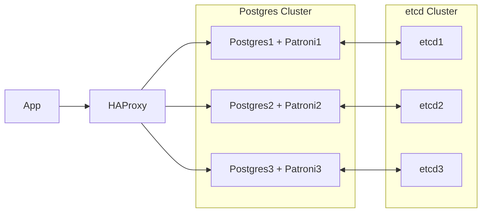

# PostgreSQL Cluster with Docker Compose

This PostgreSQL cluster is set up for high availability using **Patroni** and is containerized with Docker Compose. 

For testing the cluster, you can use the sample application available at [nickjj/docker-django-example](https://github.com/nickjj/docker-django-example).

This repository is based on the [Patroni](https://github.com/patroni/patroni) project, with files adapted for easier execution.
## Architecture



- Patroni: Manages PostgreSQL HA and failover
- ETCD: distributed key-value store used to hold and manage Patroni data
- HAProxy: Load balancing
- pgAdmin: Web UI to mange databases
- App: It could be any app that use postgres like the sammple

## Quick Start

Run these commands to start the cluster. The database will be accessible through HAProxy on ports `5000` (primary) and `5001` (replicas). pgAdmin will be available on port `81`.

```sh
git clone https://github.com/mdaneshyab/PostgresCluster-DockerCompose.git
cd PostgresCluster-DockerCompose
docker compose up -d --build
```

To test the cluster, run the sample Django application, which will be available on port `80`:

```sh
cd docker-django-example
docker compose up -d
docker compose run web python manage.py migrate
```
## Default Credentials

- All passwords: ``postgres`` (consider to change them)
- pgAdmin email: ``admin@example.com``

## Service Ports

- Django App: 80
- pgAdmin: 81
- PostgreSQL Primary (RW): 5000
- PostgreSQL Replicas (RO): 5001


